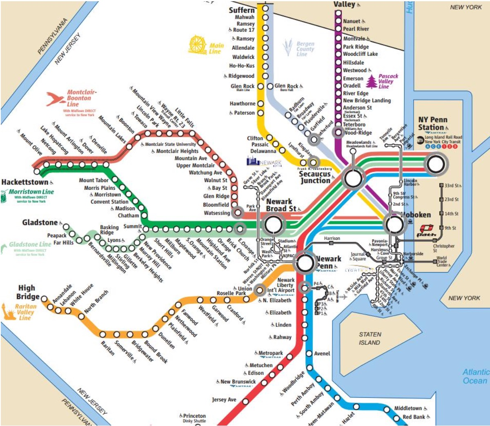

# train-meet-up

## Install and run directions
In order to compile this program, run **javac HandS.java**
To run this program, run **java HandS** then follow CL prompts

## What are the goals of this program?
This program is responsible for getting a time, from location, and to location for two characters, Harry and Sally. The program takes this information and imports the data needed to make a graph representation of the problem. The program then finds the ten shortest routes for Harry over a four hour time period and the five shortest routes for Sally over a two hour time period. These parameters can be changed in the HandS code. After finding the routes, the program compares all possible combinations and calculates the percentage change that Harry meets Sally on a train. The possible combinations are printed with information about exactly which trains were taken by each person and what train Harry and Sally met on.

**Who is Harry?** \
Harry is a guy who has lived in New Jersey his whole life and commutes exclusively using NJ Transit trains. Harry doesn’t have much to do, so he is willing to spend up to four hours commuting one way. Even though he spends a lot of time commuting, he still tries to minimize his time on trains, always picking one of the ten shortest routes.

**Who is Sally?** \
Sally is a gal who is new to New Jersey. Her hobbies include looking at maps and calculating carbon emissions. Sally spends a lot of time figuring out the least amount of trains needed to get from point A to point B. She always takes one of the five shortest routes. Sally has a day job, so she is only willing to spend two hours commuting per day.

## NJ Transit Map
Only the gray circled stops were parsed from the original data.

## What issues arise with big data in a small graph program?
In some scenarios, the traversal can take a long time. It is limited to less than the 10 shortest paths, so the probability of java data overflow is low. Most scenarios don’t have this problem, but going from large hub to large hub over a larger period of time can produce more problems; because of this, finding routes for Harry can be more time consuming than getting routes for Sally.

Java struggles with big data CSV parsing and manipulation. Data cleaing was done in python to create input files that were compatible with java. This allows for the filtering of data so the edges are only added if they fall within the time period that the user entered, preventing overloading the program and slowing it down.

## Examples of when Harry actually meets Sally!
Example 1:
- Harry: June2019, 1560603600, Rutherford, East Orange 
- Sally: June2019, 1560607200, Hoboken, Hoboken

Example 2:
- Harry: May2020, 1588870800, Union, Secaucus
- Sally: May2020, 1588870800, Newark Airport, Secaucus
